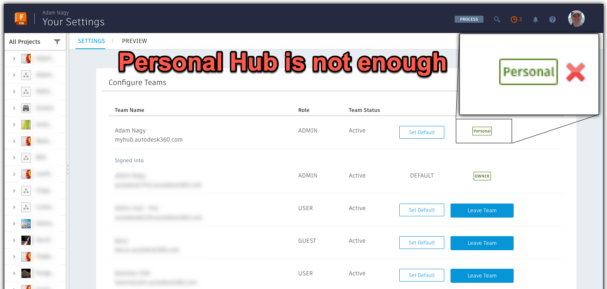
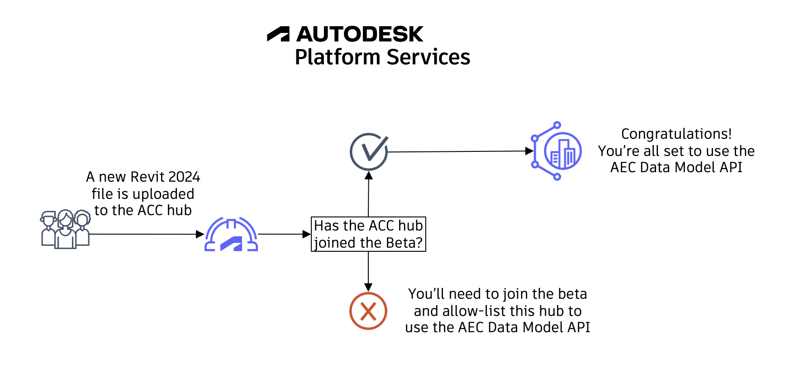
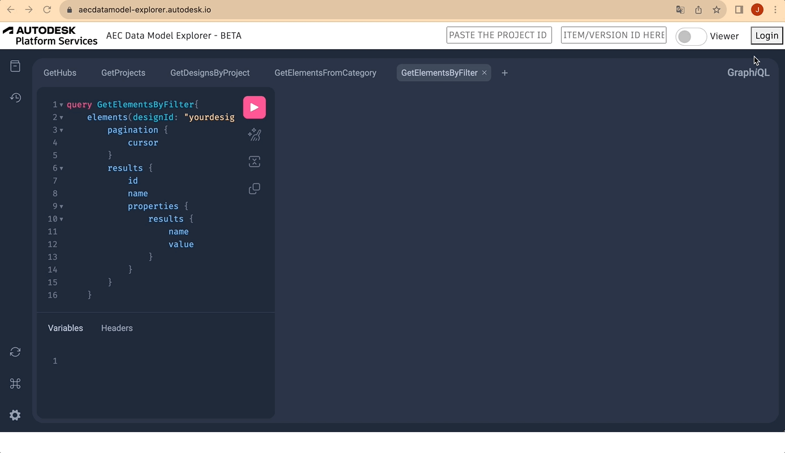

# Prerequisites

Before jumping into action, you need to fulfill a few (but essential) prerequisites to follow along with this tutorial. **The steps need to be fulfilled in sequence for you to be able to follow this tutorial (only move to the next step after completing the previous one)**:

1. Firstly, you will need a Fusion Team account (currently only available in **AMER region**). The MFG Data Model API only works for model in a Team Hub, so make sure you have that and not just a Personal Hub

Although the scope of this tutorial is just reading data, we recommend that you create a separate project for testing the MFG Data Model API.

2. If you don't have any good Fusion designs to test things with, you can open and save the [sample models](https://www.autodesk.com/support/technical/article/caas/sfdcarticles/sfdcarticles/How-to-access-samples-files-for-Fusion-360-tutorials.html) in your project using “File” -> “Save As” inside Fusion.

   

Now let's cover a quick introduction on GraphQL.

# GraphQL

The way the MFG Data Model is structured makes it a perfect match for GraphQL.

For those unfamiliar, it is a query language for APIs.
It Provides a complete and understandable description of the data in your API, and gives you the power to ask for exactly what you need and nothing more.

GraphQL is much easier to use than REST, but it requires a better understanding of data structures​.

With a single endpoint, data fetching is easier because you don't need to make requests to multiple endpoints to get a set of data.

The request specifies precisely the data that’s going to be returned

Let's compare a case where we need to check the length of a specific element in a specific version of a given design.

With the MFG Data Model GraphQL endpoint, the query looks like this:

```js
query {
  aecDesignByVersionNumber(designId: "YWVjZH5...EpfSHZ3", versionNumber:1) {
    elements(filter:{query:"'property.name.External ID'==41434aa5-...-0018527b"}){
      results{
        properties(filter:{names:["Length"]}){
          results{
            name
            value
            propertyDefinition{
              units
            }
          }
        }
      }
    }
  }
}
```

And the response for this query will look like this

```js
{
  "data": {
    "aecDesignByVersionNumber": {
      "elements": {
        "results": [
          {
            "properties": {
              "results": [
                {
                  "name": "Length",
                  "value": 11.000000000000002,
                  "propertyDefinition": {
                    "units": "Meters"
                  }
                }
              ]
            }
          }
        ]
      }
    }
  }
}
```

Note that in this case we specified that we wanted to obtain the AEC Design with id `YWVjZH5...EpfSHZ3` from version `1`.
From this design, we specified the element with `External Id` equal to `41434aa5-...-0018527b`, and from this element, we retrieved the property with a name equal to `length` including its **value**, **name**, and **unit**.

With REST API we would need additional requests, and wouldn't be possible to specify with this precision the data in the response.

To summarize, with GraphQL we have the benefits below:

- Single REST API endpoint – You only need to send your query to this endpoint when coding it in your applications
- No fixed Structure for the exchange of data – as compared to the Model Derivative REST API, where you will get a large JSON dataset, that you need to understand and be able to find the data you are looking for
- No over-fetching – as compared to the Model Derivative REST API, where you may need to call various APIs several times to get the data you are looking for.
- Efficiently using resources – Because the GraphQL implementation is on the Autodesk server side, it handles the requests to get the data you are asking for. This minimizes the traffic and allows us to optimize without disruption to the GraphQL aspects.

Before moving to the next step, let's run our very first query.

For that, you just need to go to the explorer app at `https://aecdatamodel-explorer.autodesk.io/`, log in, and run the query from the very first panel (GetHubs), just like in the image below:



If you don't see your ACC hub listed, please double check step 3.
Once you see your hub, you can move on to the next step.

> _We'll get back to GraphQL syntax throughout the queries in the next section. As it's not like the usual REST requests, we'll cover the differences and possibilities in parallel, while also learning the supported AEC Data Model API queries._

[Next Step - Explorer and First Queries](../../explorer/home/){: .btn}
